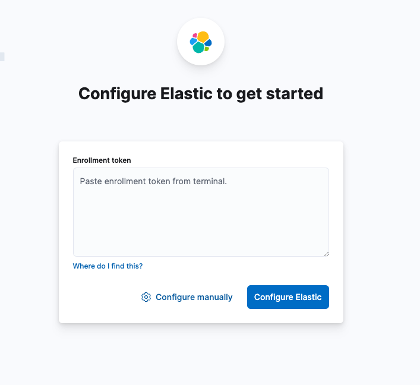
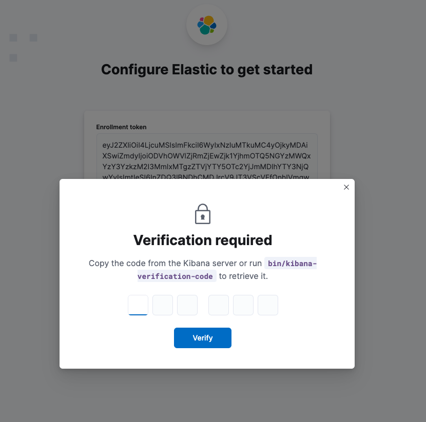
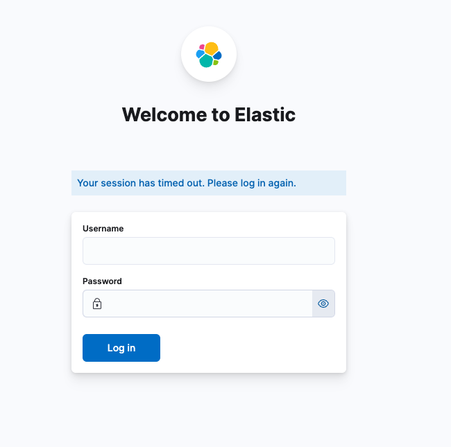

# Set up tutorial for Elastic Search

## 1. Build enbvironment
```
docker compose up -d
```
Then, you can access to http://localhost:5601/ 
When you access it, you can wathc the interface below.



## 2. Get token code
```
docker exec elasticsearch bin/elasticsearch-create-enrollment-token --scope kibana
```
Then, you can get the token code.
When you paste it to the interface, the screen will change like below.



## 3. Get verification code
```
docker exec kibana bin/kibana-verification-code
```
Then, you can get the verification code.
When you fill it to the screen, you will see the login screen like below.



## 4. Reset password
```
docker exec -it elasticsearch bin/elasticsearch-reset-password -u elastic
```
Then, you can get new password and now you can login.
Username: elastic
Password: the result by the command above. You should also keep this password for later use.

## 5. Set environment variables
```
touch .env
```
This will allow you to create an .env file, so put the following in the file

```
ELASTIC_PASSWORD=XXXXX # Password you kept
```